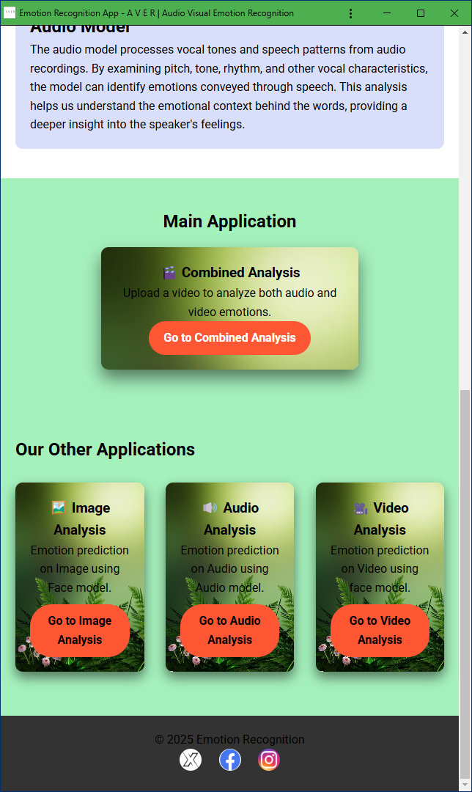
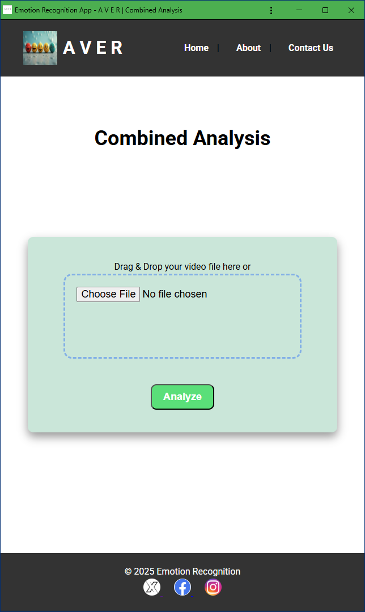
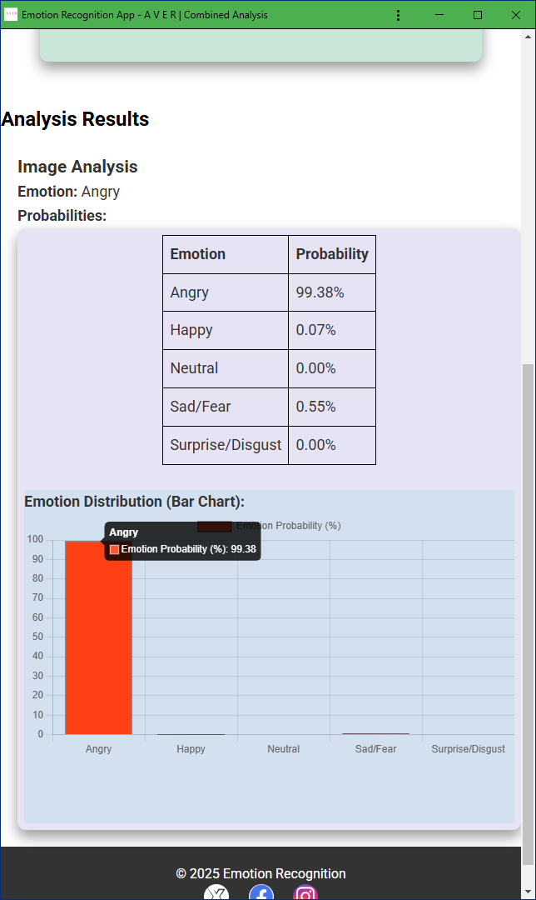

# A V E R (Audio Visual Emotion Recognition)

A V E R is a web application built with Flask that performs emotion recognition from audio, video, and images. It provides a user-friendly interface where users can upload files for analysis, and the system will process and return the analysis results. The system leverages deep learning models for emotion detection and visualizes the outcomes in an interactive and insightful way.

## Application Screenshots

### Main Page & Combined Analysis Page &  Results Page
  


## Features

- **Audio Emotion Recognition**: Detects emotions from audio files.
- **Face Emotion Recognition**: Analyzes facial expressions to infer emotions.
- **Video Emotion Recognition**: Processes video files to detect emotions from both the audio and video frames.
- **Combined Analysis**: Analyzes both audio and video for a comprehensive emotion analysis.
- **Interactive Frontend**: Upload files via drag-and-drop or form submission for real-time analysis.
- **Analysis Results**: Displays results in tables and graphs, such as average emotions and emotion trends over time.

## Audio Model: Two-Parallel CNN with Transformer Encoder  
The audio model combines a dual **Convolutional Neural Network (CNN)** for feature extraction with a **Transformer Encoder** for temporal sequence modeling. The CNN processes **Mel-Frequency Cepstral Coefficients (MFCCs)**, while the Transformer captures sequential dependencies in speech data.  

- **CNN Architecture**:  
  - Three Conv2D layers (16, 32, 64 filters) with 3×3 kernels.  
  - MaxPooling layers (4×4 stride) for dimensionality reduction.  
- **Transformer Encoder**:  
  - Models pitch transitions and speech patterns for improved emotion recognition.  
- **Dataset**: RAVDESS (speech & song) with data augmentation.  
- **Training**:  
  - Input shape: `(7356, 1, 40, 282)`  
  - Optimizer: SGD with learning rate 0.01  
  - Accuracy: **73.23% on 8-class emotion classification**  

## Video Models  

### LRCN Model (Long-term Recurrent Convolutional Network)  
LRCN integrates **CNN and LSTM** to extract spatiotemporal features from video frames. The CNN captures spatial details, while LSTM learns temporal relationships.  

- **Architecture**:  
  - TimeDistributed Conv2D + MaxPooling2D + Dropout  
  - Flatten layer → LSTM → Dense Softmax layer for classification  
- **Input Shape**: `(30, 64, 64, 3)` (30 frames, 64x64 RGB)  
- **Dataset**: RAVDESS, SAVEE  
- **Results**: Emotion classification using video sequences  

### ConvLSTM Model (Convolutional LSTM)  
ConvLSTM improves upon LRCN by embedding convolution directly within the LSTM architecture, making it more efficient for capturing spatial and temporal relationships.  

- **Architecture**:  
  - ConvLSTM2D layers with MaxPooling3D  
  - Dropout layers for regularization  
  - Dense Softmax layer for final prediction  
- **Experiments & Results**:  
  - Baseline ConvLSTM: **74.80% accuracy**  
  - With Batch Normalization: **71.98% accuracy**  
  - With Landmark-based Normalization: **84.54% accuracy**  
- **Best model: ConvLSTM with landmark-based normalization (84.54% accuracy)**  

## Summary  
- **Audio model (CNN + Transformer)**: 73.23% accuracy (MFCC features).  
- **LRCN model (CNN + LSTM)**: Video-based emotion recognition.  
- **ConvLSTM model (Convolutional LSTM)**: Best performance with 84.54% accuracy.  

These models provide robust **audio-visual emotion recognition** using deep learning.  

## Prerequisites

- This is tested on Python 3.10.16  

Machine Learning & Deep Learning:
- `tensorflow`, `torch`, `keras`, `scikit-learn`, `jax`

Computer Vision & Image Processing:
- `opencv`, `albumentations`, `imageio`, `matplotlib`, `scikit-image`

Natural Language Processing:
- `spacy`, `nltk`, `sentencepiece`, `tiktoken`

Audio Processing:
- `librosa`, `pydub`, `soundfile`, `SpeechRecognition`, `noisereduce`

Flask & Web Development:
- `Flask`, `Flask-Cors`

Miscellaneous Utilities:
- `rich`, `pytest`,`requests`, `pandas`, `protobuf`, `ffmpeg-python`

 
 - -Other dependencies listed in `requirements.txt`


## Installation

### CMake
CMake is a cross-platform build system generator. Download it from the official website:

- [CMake Download](https://cmake.org/download/)

### BuildTools
Microsoft Build Tools are required for building the project on Windows. Download it from:

- [BuildTools for Visual Studio](https://visualstudio.microsoft.com/visual-cpp-build-tools/)

### Steps to Set Up

1.Clone the repository:

    git clone https://github.com/Ram-ambati/A-V-E-R.git
    cd A-V-E-R
    
2.Create the virtual environment
   
    python -m venv venv 
    
2.1 or use 

    conda create -n MyEnv python=3.10
    
3.Activate the virtual environment
  On Windows activate your env

    .\venv\Scripts\activate
    
3.1 or use

     conda activate MyEnv

    
4.Install the required dependencies:

    pip install -r requirements.txt

5.Run the `setup.py`  (once) to create folders and set paths to models 

    python setup.py
    
6.Run the Flask application:

    python app.py

The app will be accessible at `http://127.0.0.1:5000/`.


## Folder Structure

The directory structure of the project is as follows, so make sure you downloaded everything:
```
├── .git/
├── __pycache__/
├── AnalysisResults/
├── data/
├── input_files/
├── models/
├── output_files/
├── source/
├── static/
├── templates/
├── VideoBufferFolder/
├── .gitattributes
├── app.py
├── requirements.txt
├── run.py
└── setup.py
```


## Test Usage of run.py

To test the **run.py** script, use the following command formats:

- **Video Analysis:**
-     
       python run.py -VA video.mp4
  
  Analyzes the provided **video file** for emotion recognition and stores results as JSON in `analysis_results`

- **Audio Analysis:**
   
      python run.py -AA audio.mp3
    
  Processes an **audio file** to detect emotions and stores results as JSON in `analysis_results`

- **Image Analysis:**
  
      python run.py -IA image.png
  
  Performs analysis on an **image file** and stores results as JSON in `analysis_results`

- **Combined Analysis:**
  
      python run.py -CA video.mp4
  
  Executes both **audio and video** emotion recognition and stores results as JSON in `analysis_results`

- **Auto-Detect Mode:**
  
      python run.py file_name
  
  Automatically detects the file type and applies the appropriate analysis and stores results as JSON in `analysis_results`

Ensure you provide a valid **file format** (MP4, MP3, PNG) which is inside the `input_files` folder for proper testing.

## How It Works

1. **File Upload**: Users upload an audio, video, or image file through the frontend interface.
2. - **POST /upload**: Uploads files (image, audio, video) for analysis.
3. **Analysis**: Based on the selected analysis type, the backend calls the appropriate functions from the `audio_analysis_utils`, `face_emotion_utils`, or a combined analysis script.
4. **Result Processing**: The results are structured, saved in JSON format.
5. - **GET /analysis/{file_name}**: Retrieves the analysis results in JSON format for the specified file.
6. **Visualization**: Results such as emotion trends are visualized using tables and charts.

